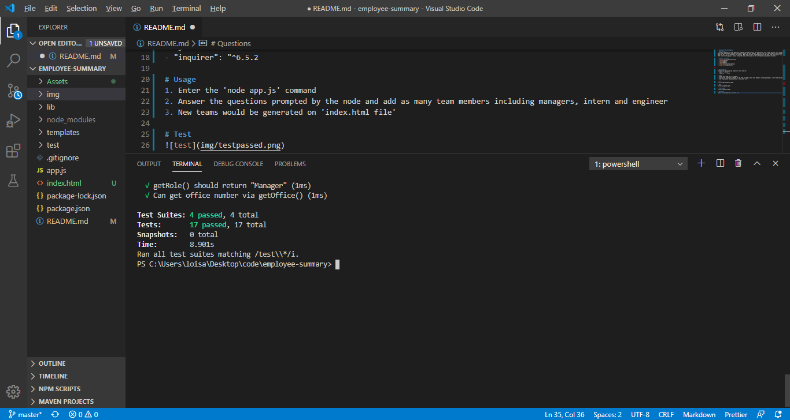
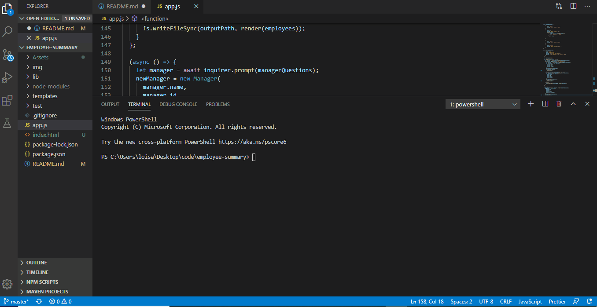

# Employee-Template-Engine
# Description
A software engineering team generator command line application. The application will prompt the user for information about the team manager and then information about the team members. The user can input any number of team members, and they may be a mix of engineers and interns. When the user has completed building the team, the application will create an HTML file that displays a nicely formatted team roster based on the information provided by the user.

# Table of Contents
1. [Installation](#Installation)
2. [Usage](#Usage)
3. [Test](#Test)
4. [Demo](#Demo)
5. [Team-Output](#Team-Output)
6. [Questions](#Questions)

# Installation
Install the following npm modules to test and run:
- "jest": "^24.9.0"
- "inquirer": "^6.5.2

# Usage
1. Enter the 'node app.js' command
2. Answer the questions prompted by the node and add as many team members including managers, intern and engineer
3. New teams would be generated on 'index.html file'

# Test

# Demo

# Team-Output

# Questions
Email: loisaleghe@cmail.carleton.ca